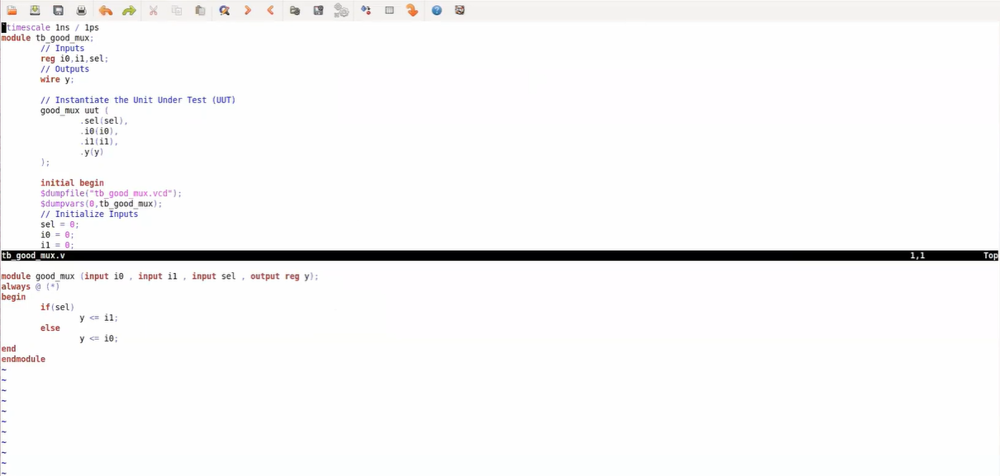
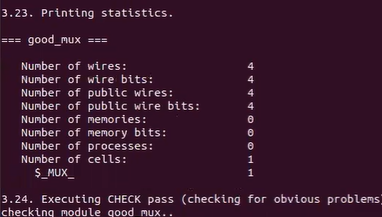
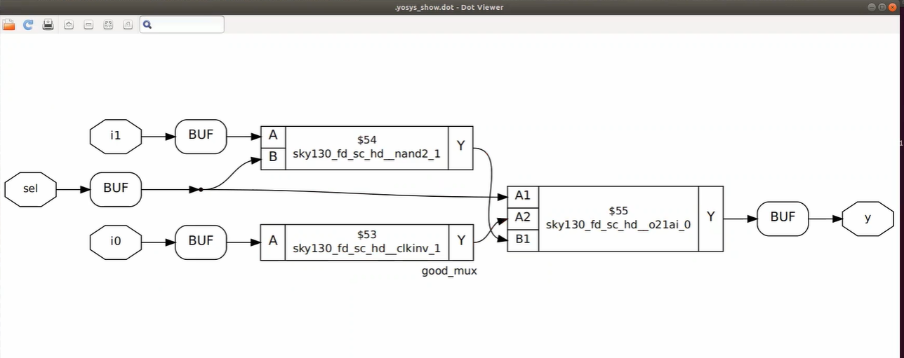
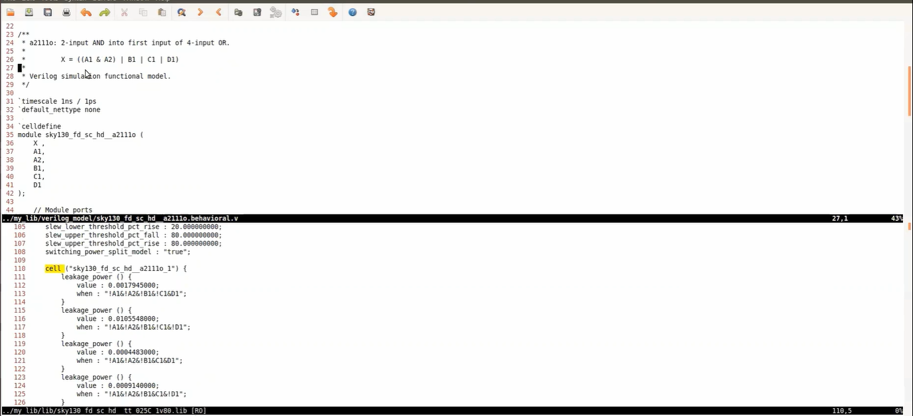
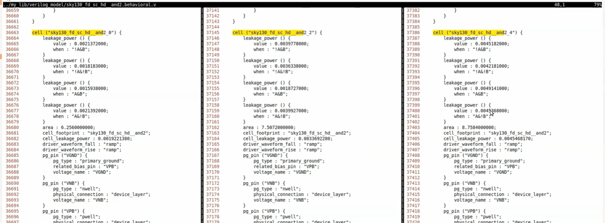
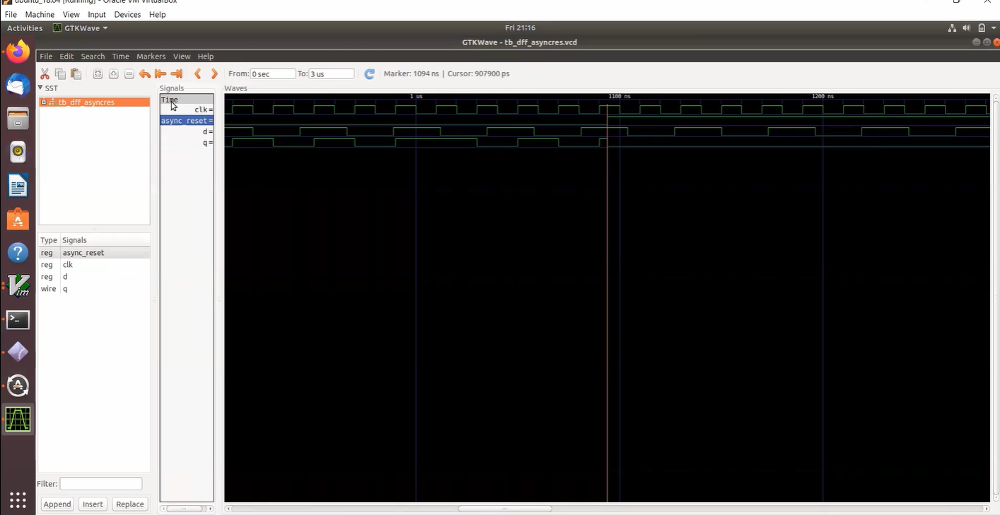
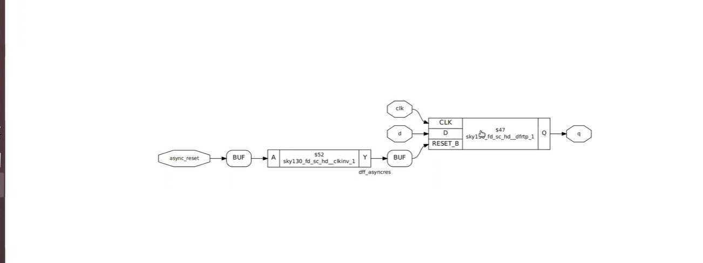

<p align="center">
  
</p>

<h1 align="center">VSD_RTL_DESIGN_SYNTHESIS_WORKSHOP</h1>

<p align="center">
  <b>Created by Rachit Srivastava</b><br>
  Hands-on labs covering RTL simulation, gate-level synthesis, timing libraries, and flip-flop design using open-source EDA tools on SkyWater 130nm PDK
</p>

<p align="center">
  <a href="#module-1--rtl-simulation--synthesis"></a>
  <a href="#module-2--timing-libraries-hierarchical-synthesis--flop-styles"></a>
</p>

<p align="center">
  
  
  
  
</p>

---

## 📌 Project Overview

This repository documents an intensive **12-hour RTL design assessment** performed as part of the **VSD Squadron Internship**. The project traces the development of digital logic from behavioral specifications in Verilog to a fully synthesized gate-level netlist, utilizing the open-source SkyWater 130nm PDK.

| Detail | Specifications |
| :--- | :--- |
| **Internship Program** | VSD Squadron — SoC & RTL Synthesis |
| **Milestone** | Module 1 & 2 Laboratory Reports |
| **CAD Environment** | Icarus Verilog, GTKWave, Yosys 0.7 |
| **Technology Node** | SkyWater SKY130 (High-Density Cells) |
| **Host OS** | Ubuntu 20.04 (LTS) |

---

## 🚦 Navigation Index

- [Part I — RTL Verification & Basic Synthesis](#part-i--rtl-verification--basic-synthesis)
  - [1.1 Workspace Setup](#11-workspace-setup)
  - [1.2 2:1 Multiplexer Simulation](#12-21-multiplexer-simulation)
  - [1.3 Waveform Verification](#13-waveform-verification)
  - [1.4 Implementation Logic](#14-implementation-logic)
  - [1.5 Logic Mapping with Yosys](#15-logic-mapping-with-yosys)
  - [1.6 Synthesis Execution](#16-synthesis-execution)
  - [1.7 Post-Synthesis Schematic](#17-post-synthesis-schematic)
  - [1.8 Final Netlist Generation](#18-final-netlist-generation)
- [Part II — Timing, Hierarchy, and Sequential Logic](#part-ii--timing-hierarchy-and-sequential-logic)
  - [2.1 Analyzing the .lib Timing Model](#21-analyzing-the-lib-timing-model)
  - [2.2 Standard Cell Characteristics](#22-standard-cell-characteristics)
  - [2.3 Propagation Delay Analysis](#23-propagation-delay-analysis)
  - [2.4 Performance Trade-offs in Cells](#24-performance-trade-offs-in-cells)
  - [2.5 Hierarchical Design Strategies](#25-hierarchical-design-strategies)
  - [2.6 Logic Flatting Comparison](#26-logic-flatting-comparison)
  - [2.7 Specialized Synthesis Flow](#27-specialized-synthesis-flow)
  - [2.8 Sequential Elements: Flip-Flops](#28-sequential-elements-flip-flops)
  - [2.9 Multiplier Logic Optimization](#29-multiplier-logic-optimization)
- [Toolchain Reference](#toolchain-reference)
- [Design File Index](#design-file-index)
- [Key Takeaways](#key-takeaways)
- [Acknowledgements](#acknowledgements)

---

## Toolchain Reference

All labs ran on a pre-configured VSD VM with the stack below. Here's the quick-reference for how each tool fits the pipeline:

| Tool | What It Does | Key Command |
|:---|:---|:---|
| **Icarus Verilog** | Compiles RTL + testbench → runs simulation → produces `.vcd` | `iverilog -o sim design.v tb.v && ./sim` |
| **GTKWave** | Opens `.vcd` files for visual signal inspection | `gtkwave tb_design.vcd` |
| **Yosys** | Reads RTL + Liberty `.lib` → synthesizes gate-level netlist | `read_verilog` → `synth` → `abc` → `show` / `write_verilog` |
| **SKY130 PDK** | Real 130nm cell library providing timing, area, and power data | `sky130_fd_sc_hd__tt_025C_1v80.lib` |

**Workshop directory layout:**
```
sky130RTLDesignAndSynthesisWorkshop/
├── my_lib/
│   ├── lib/
│   │   └── sky130_fd_sc_hd__tt_025C_1v80.lib
│   └── verilog_model/
│       └── primitives.v
└── verilog_files/
    ├── good_mux.v / tb_good_mux.v
    ├── multiple_modules.v
    ├── dff_asyncres.v / dff_async_set.v / dff_syncres.v
    └── mult_2.v / mult_8.v
```

---

## Design File Index

| File | Module | Type | What It Implements |
|:---|:---|:---|:---|
| `good_mux.v` | `good_mux` | Combinational | 2:1 MUX — output follows `i0` or `i1` based on `sel` |
| `multiple_modules.v` | `multiple_modules` | Hierarchical | Top module wiring an AND sub-module into an OR sub-module |
| `dff_asyncres.v` | `dff_asyncres` | Sequential | DFF with async active-high reset (resets to 0 immediately) |
| `dff_async_set.v` | `dff_async_set` | Sequential | DFF with async active-high set (sets to 1 immediately) |
| `dff_syncres.v` | `dff_syncres` | Sequential | DFF with sync reset (resets to 0 only on next clock edge) |
| `mult_2.v` | `mul2` | Combinational | ×2 multiplier — optimizes to zero gates (wire shift) |
| `mult_8.v` | `mult8` | Combinational | ×8 multiplier — optimizes to zero gates (wire shift) |

---

## Part I — RTL Verification & Basic Synthesis

> **Objective:** Execute a complete front-end design cycle for a `good_mux.v` design, covering initial behavioral simulation through to final gate-level synthesis using Yosys and the SKY130 PDK.

---

### 1.1 Workspace Setup

Before beginning, I verified the presence of all required RTL source files and verification testbenches within the project directory:

List the available designs and testbenches in the workshop directory:

```bash
cd /home/vsd/VLSI/sky130RTLDesignAndSynthesisWorkshop/verilog_files
ls
```

<p align="center">
  
</p>

> The directory ships with dozens of RTL files (`.v`) and matching testbenches (`tb_*.v`). For Module 1, the focus is `good_mux.v` and `tb_good_mux.v`.

---

### 1.2 Simulating a 2:1 MUX

Compile the design together with its testbench, then run the resulting executable to generate the waveform dump:

```bash
iverilog good_mux.v tb_good_mux.v
./a.out
# → VCD info: dumpfile tb_good_mux.vcd opened for output.
```

<p align="center">
  
</p>

> Icarus Verilog produces `tb_good_mux.vcd` — every signal transition is recorded with nanosecond timestamps, ready for GTKWave.

---

### 1.3 Waveform Analysis

Open the `.vcd` in GTKWave and add all signals to the viewer:

```bash
gtkwave tb_good_mux.vcd
```

<p align="center">
  
</p>

<p align="center">
  
</p>

> **Reading the waveform:** When `sel = 0`, output `y` tracks `i0`. When `sel = 1`, `y` switches to follow `i1`. This confirms correct 2:1 MUX behavior.

---

### 1.4 RTL & Testbench Source

View both files side-by-side in `gvim`:

```bash
gvim tb_good_mux.v -o good_mux.v
```

<p align="center">
  
</p>

<details>
<summary><b>📄 RTL — <code>good_mux.v</code></b></summary>

```verilog
module good_mux (input i0, input i1, input sel, output reg y);
  always @ (*)
  begin
    if (sel)
      y <= i1;
    else
      y <= i0;
  end
endmodule
```
> Combinational 2:1 MUX using `always @(*)` — triggers on any input change.
</details>

<details>
<summary><b>📄 Testbench — <code>tb_good_mux.v</code></b></summary>

```verilog
`timescale 1ns / 1ps
module tb_good_mux;
  reg i0, i1, sel;
  wire y;

  good_mux uut (.sel(sel), .i0(i0), .i1(i1), .y(y));

  initial begin
    $dumpfile("tb_good_mux.vcd");
    $dumpvars(0, tb_good_mux);
    sel = 0; i0 = 0; i1 = 0;
    // Apply stimulus...
  end
endmodule
```
> Instantiates the DUT, drives stimulus, dumps all signals to a `.vcd` file.
</details>

---

### 1.5 Yosys — Loading the Library

Launch Yosys and import the SKY130 standard cell library:

```bash
yosys
yosys> read_liberty -lib ../my_lib/lib/sky130_fd_sc_hd__tt_025C_1v80.lib
```

<p align="center">
  
</p>

<p align="center">
  
</p>

> Yosys loads the TT corner library (Typical process, 25°C, 1.80V) with **428 cell types** available for mapping.

---

### 1.6 Running Synthesis

Read the Verilog source and synthesize:

```bash
yosys> read_verilog good_mux.v
yosys> synth -top good_mux
```

<p align="center">
  
</p>

<p align="center">
  
</p>

<p align="center">
  
</p>

> Yosys infers the design as **1 MUX primitive** (`$_MUX_`). After technology mapping with `abc -liberty`, this maps to real SKY130 cells.

---

### 1.7 Synthesized Schematic

```bash
yosys> show
```

<p align="center">
  
</p>

> The 2:1 MUX is implemented with three SKY130 cells — a clock inverter (`clkinv_1`), a NAND gate (`nand2_1`), and an OR-AND-Invert gate (`o21ai_0`) — realizing `y = (sel · i1) + (sel' · i0)`.

---

### 1.8 Gate-Level Netlist

Generate and inspect the structural Verilog:

```bash
yosys> write_verilog good_mux_netlist.v
yosys> !gvim good_mux_netlist.v
```

<p align="center">
  
</p>

<p align="center">
  
</p>

<details>
<summary><b>📄 Generated Netlist — <code>good_mux_netlist.v</code></b></summary>

```verilog
/* Generated by Yosys 0.7 */
module good_mux(i0, i1, sel, y);
  wire _0_, _1_, _2_, _3_, _4_, _5_;
  input i0, i1, sel;
  output y;

  sky130_fd_sc_hd__clkinv_1 _6_ (.A(_0_), .Y(_4_));
  sky130_fd_sc_hd__nand2_1 _7_ (.A(_1_), .B(_2_), .Y(_5_));
  sky130_fd_sc_hd__o21ai_0 _8_ (.A1(_2_), .A2(_4_), .B1(_5_), .Y(_3_));

  assign _0_ = i0;
  assign _1_ = i1;
  assign _2_ = sel;
  assign y   = _3_;
endmodule
```
</details>

> This netlist is functionally equivalent to the original RTL but expressed entirely in SKY130 standard cells — ready for place-and-route or gate-level simulation.

---

## Part II — Timing, Hierarchy, and Sequential Logic

> **Objective:** Explore the internal structure of the SKY130 timing library, evaluate the impact of hierarchical vs. flat synthesis, and verify various flip-flop implementation styles.

---

### 2.1 Analyzing the .lib Timing Model

Open the library file and examine its header:

```bash
gvim ../my_lib/lib/sky130_fd_sc_hd__tt_025C_1v80.lib
```

<p align="center">
  
</p>

<p align="center">
  
</p>

> **Key parameters:** CMOS technology, table-lookup delay model, timing in `ns`, capacitance in `pF`, operating at the `tt_025C_1v80` corner.

---

### 2.2 Cell Definitions & Behavioral Models

Each cell entry includes a boolean function and leakage power for every input combination:

<p align="center">
  
</p>

> Example: `sky130_fd_sc_hd__a2111o` implements `X = ((A1 & A2) | B1 | C1 | D1)`. The `.lib` encodes per-input-state leakage for accurate power estimation.

---

### 2.3 Timing Arcs & Delay Tables

<p align="center">
  
</p>

> Each cell has 2D NLDM tables for `cell_rise`, `cell_fall`, `rise_transition`, and `fall_transition`, indexed by input slew × output load capacitance. These drive accurate static timing analysis.

---

### 2.4 Comparing Cell Flavors

<p align="center">
  
</p>

> **Trade-off in action:** `and2_0` (area 6.256, leak 0.0019 nW) is the smallest/slowest. `and2_4` (area 8.758, leak 0.0045 nW) is the largest/fastest. The synthesizer picks the right flavor based on timing constraints.

---

### 2.5 Hierarchical Synthesis

Synthesize `multiple_modules.v` which instantiates `sub_module1` (AND) and `sub_module2` (OR):

```bash
yosys> read_liberty -lib ../my_lib/lib/sky130_fd_sc_hd__tt_025C_1v80.lib
yosys> read_verilog multiple_modules.v
yosys> synth -top multiple_modules
```

<p align="center">
  
</p>

<p align="center">
  
</p>

> Yosys preserves the module boundaries: `sub_module1` maps to 1 `$_AND_`, `sub_module2` maps to 1 `$_OR_`, and the top contains 2 cells total.

---

### 2.6 Hierarchical Schematic

```bash
yosys> abc -liberty ../my_lib/lib/sky130_fd_sc_hd__tt_025C_1v80.lib
yosys> show multiple_modules
```

<p align="center">
  
</p>

> Sub-module boundaries are intact — `u1 (sub_module1)` and `u2 (sub_module2)` appear as distinct blocks connected by `net1`.

---

### 2.7 Flat Synthesis & Comparison

After running `flatten`, all module hierarchy dissolves into a single level:

<p align="center">
  
</p>

<p align="center">
  
</p>

> **Impact of Flattening:** By dissolving sub-module boundaries, Yosys can perform global optimizations. For instance, an OR gate might be decomposed into `NAND` and `INV` gates to leverage the superior speed of NAND cells in the Sky130 process.

| Metric | Hierarchical Approach | Flattened Approach |
|:---|:---|:---|
| **Structural Integrity** | Boundaries maintained | Boundaries collapsed |
| **Primary Use Case** | Debugging & Block Reuse | Performance & Area Sign-off |
| **Synthesis Scope** | Local (Per-module) | Global (Across boundaries) |
| **Logic Visibility** | High | Abstracted |

---

### 2.8 Sub-Module Synthesis

Yosys can also synthesize individual sub-modules in isolation:

<p align="center">
  
</p>

> Useful for very large designs or when the same sub-module is instantiated many times — synthesize once, reuse the netlist.

---

### 2.9 Flip-Flop RTL Overview

Three DFF coding styles are explored — async reset, async set, and sync reset:

<p align="center">
  
</p>

<details>
<summary><b>📄 Async Reset DFF — <code>dff_asyncres.v</code></b></summary>

```verilog
module dff_asyncres (input clk, input async_reset, input d, output reg q);
  always @ (posedge clk, posedge async_reset)
  begin
    if (async_reset)
      q <= 1'b0;      // Resets immediately — no clock needed
    else
      q <= d;
  end
endmodule
```
</details>

<details>
<summary><b>📄 Async Set DFF — <code>dff_async_set.v</code></b></summary>

```verilog
module dff_async_set (input clk, input async_set, input d, output reg q);
  always @ (posedge clk, posedge async_set)
  begin
    if (async_set)
      q <= 1'b1;      // Sets to 1 immediately
    else
      q <= d;
  end
endmodule
```
</details>

<details>
<summary><b>📄 Sync Reset DFF — <code>dff_syncres.v</code></b></summary>

```verilog
module dff_syncres (input clk, input sync_reset, input d, output reg q);
  always @ (posedge clk)
  begin
    if (sync_reset)
      q <= 1'b0;      // Resets only on the next rising clock edge
    else
      q <= d;
  end
endmodule
```
</details>

> **The key difference:** Async reset/set appears in the sensitivity list alongside `clk`, so it takes effect immediately. Sync reset is evaluated only inside the clocked block.

---

### 2.10 Async Reset DFF — Simulation

```bash
iverilog dff_asyncres.v tb_dff_asyncres.v
./a.out
gtkwave tb_dff_asyncres.vcd
```

<p align="center">
  
</p>

> When `async_reset` goes HIGH, `q` drops to `0` **instantly** — no waiting for the clock. When deasserted, `q` resumes tracking `d` on each rising edge. ✅

---

### 2.11 Sync Reset DFF — Simulation

```bash
iverilog dff_syncres.v tb_dff_syncres.v
./a.out
gtkwave tb_dff_syncres.vcd
```

<p align="center">
  
</p>

> When `sync_reset` goes HIGH, `q` doesn't change until the **next rising clock edge** — confirming synchronous behavior. ✅

---

### 2.12 Async Reset DFF — Synthesis

```bash
yosys> read_liberty -lib ../my_lib/lib/sky130_fd_sc_hd__tt_025C_1v80.lib
yosys> read_verilog dff_asyncres.v
yosys> synth -top dff_asyncres
yosys> dfflibmap -liberty ../my_lib/lib/sky130_fd_sc_hd__tt_025C_1v80.lib
yosys> abc -liberty ../my_lib/lib/sky130_fd_sc_hd__tt_025C_1v80.lib
yosys> show
```

<p align="center">
  
</p>

<p align="center">
  
</p>

<p align="center">
  
</p>

> Yosys infers `$_DFF_PP0_` and maps it to **`sky130_fd_sc_hd__dfrtp_1`** (DFF with active-low reset). An inverter is automatically inserted to convert the active-high RTL reset to the cell's active-low `RESET_B` pin.

---

### 2.13 Async Set DFF — Synthesis

<p align="center">
  
</p>

> Maps to **`sky130_fd_sc_hd__dfstp_2`** (DFF with active-low set). Again, an inverter bridges the active-high RTL signal to the cell's `SET_B` pin.

---

### 2.14 Multiplier Optimization

Yosys recognizes power-of-2 multiplications as simple bit shifts and eliminates all logic:

**`mul2` — Multiply by 2:**

<p align="center">
  
</p>

> `a * 2` = `{a, 1'b0}` (left-shift by 1). **Zero gates needed** — pure wire routing.

**`mult8` — Multiply by 8:**

<p align="center">
  
</p>

> `a * 8` = `{a, 3'b000}` (left-shift by 3). Again **zero gates** — the synthesizer is smart enough to turn this into wiring.

---

## 💡 Key Learnings & Insights

1. **Simulation vs. Synthesis Gap:** Functional simulation alone is insufficient. Hardware mapping requires synthesizable constructs; non-synthesizable code like `#delay` will be ignored by the logic compiler.

2. **RTL Coding Impact on Hardware:** The choice of reset strategy (Synchronous vs. Asynchronous) directly determines the specific standard cell selected from the library.

3. **Optimization Efficiency:** Modern synthesis tools like Yosys can eliminate entire blocks of logic for trivial operations, such as power-of-2 multiplications, converting them into simple bit-shifts.

4. **Strategic Hierarchy:** While hierarchical designs are easier to manage, flattening allows for global optimizations that can significantly improve area and timing.

5. **Library-Driven Design:** The `.lib` file is the backbone of the synthesis flow, providing the necessary data for the tool to balance performance and power consumption.

---

## 🤝 Acknowledgements

- **Kunal Ghosh** — For the guidance and the VSD workshop platform.
- **VSDIAT Team** — For providing the virtual laboratory and curriculum.
- **Open-Source EDA Community** — For the powerful tools (Yosys, Icarus, GTKWave) and the SkyWater SKY130 PDK.

---

<p align="center">
  <b>Developed by Rachit Srivastava | VSD Squadron SoC Internship 2024</b>
</p>

<p align="center">
  <i>Documentation of a 12-hour intensive assessment on RTL Design and Synthesis.</i>
</p>
