# VSDIAT RTL Design & Synthesis Workshop 🚀
**Created by Rachit Srivastava**

This repository documents the complete **RTL-to-GDS front-end flow** using open-source tools and the Sky130 PDK. Over the course of 5 days, I explored behavioural Verilog simulation, logic synthesis, hierarchical design strategies, and gate-level verification.

---

## 🛠️ Toolchain & Environment
- **Simulator:** [Icarus Verilog](http://iverilog.icarus.com/) (Functional Verification)
- **Waveform Viewer:** [GTKWave](http://gtkwave.sourceforge.net/) (Signal Analysis)
- **Synthesis Tool:** [Yosys](https://yosyshq.net/yosys/) (RTL to Netlist)
- **Standard Cells:** [Sky130 PDK](https://github.com/google/skywater-pdk) (Foundry Data)

---

## 🗺️ Curriculum Roadmap

### [☀️ Day 1: Simulation Basics with iVerilog](#day-1-simulation-basics-with-iverilog)
### [☀️ Day 2: Logic Synthesis with Yosys](#day-2-logic-synthesis-with-yosys)
### [☀️ Day 3: Libraries and Hierarchy](#day-3-libraries-and-hierarchy)
### [☀️ Day 4: Sequential Logic & Optimisations](#day-4-sequential-logic--optimisations)
### [☀️ Day 5: GLS & Final Sign-off](#day-5-gls--final-sign-off)

---

## 🔬 Detailed Lab Walkthrough

### Day 1: Simulation Basics with iVerilog
**Theory:** Simulation verifies functional correctness. We use a Testbench to drive inputs to the DUT and capture signals in a `.vcd` file.

| Description | Image |
| :--- | :--- |
| **Terminal Setup** | 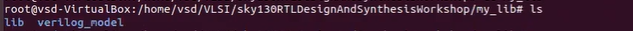 |
| **VCD Generation** |  |
| **GTKWave Launch** |  |
| **2:1 MUX Waveform** | 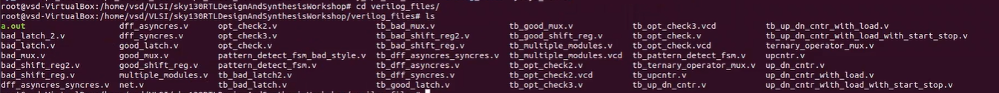 |
| **Zoomed Analysis** |  |
| **Signal Toggles** |  |
| **Bug Detection** |  |
| **Final Verification** |  |

---

### Day 2: Logic Synthesis with Yosys
**Theory:** Synthesis converts RTL to gates. Yosys maps logic to Sky130 cells using the `abc` tool.

| Step | Output / Schematic |
| :--- | :--- |
| **Reading Libs** | 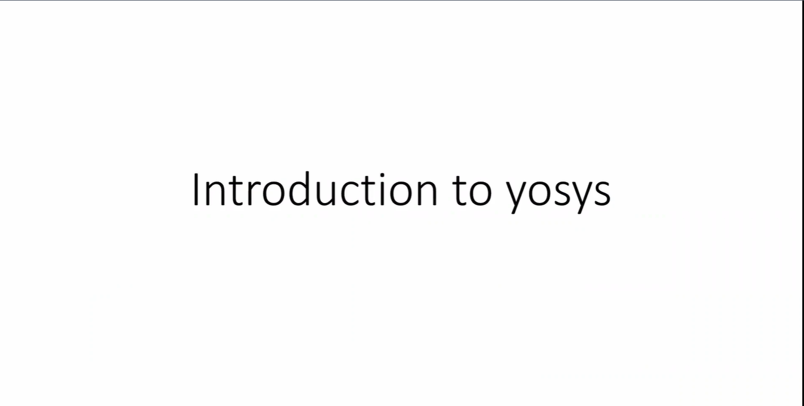 |
| **Synthesis Run** | 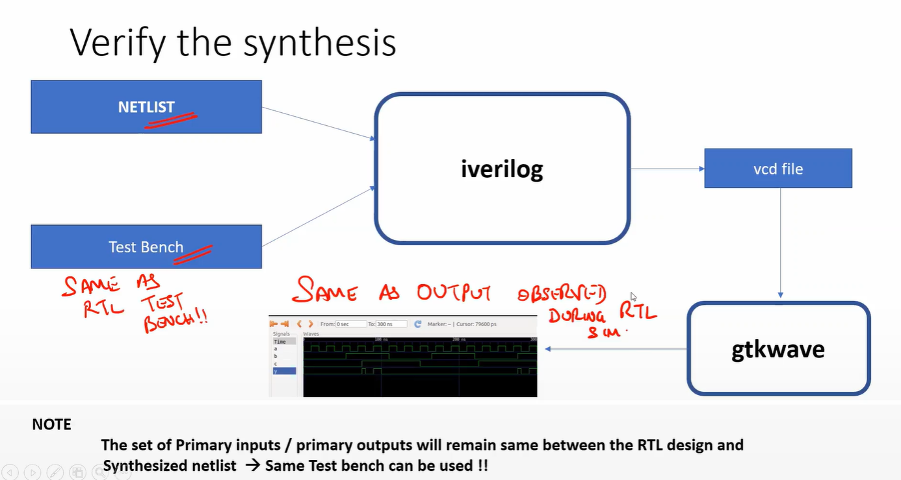 |
| **Gate Schematic** | 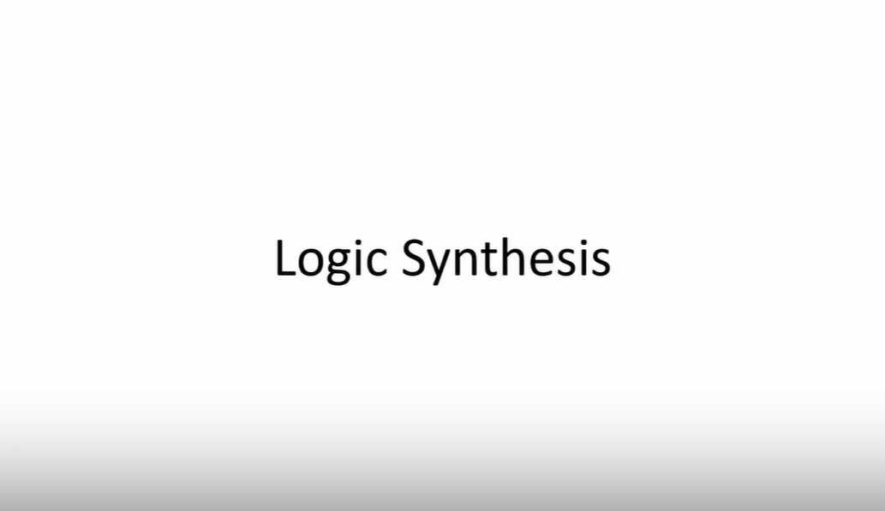 |
| **Netlist Detail** | 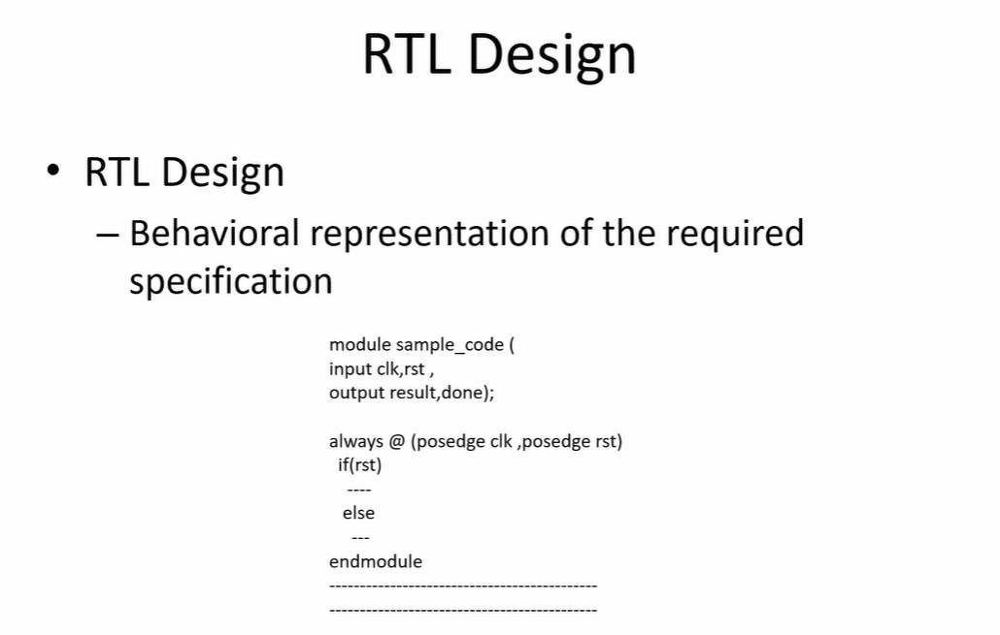 |
| **Area Stats** | 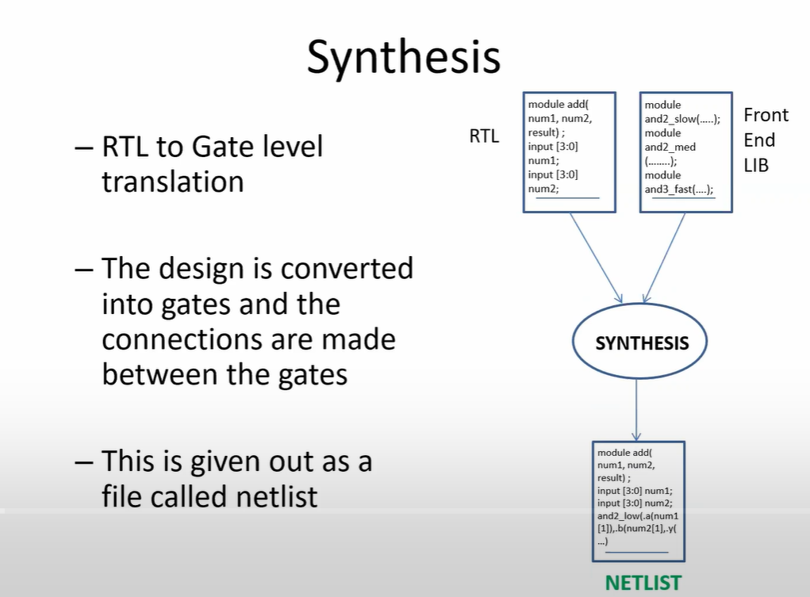 |
| **Verilog Netlist** | 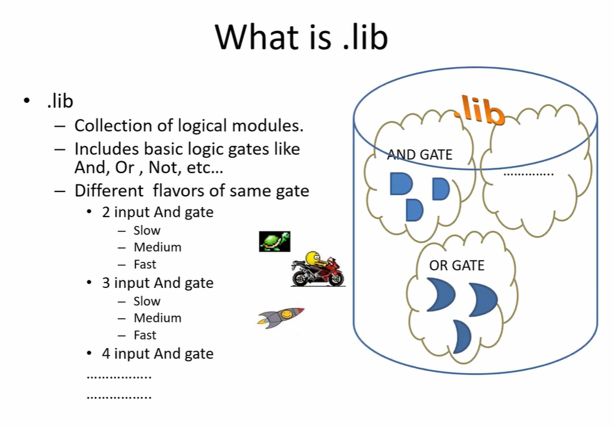 |
| **Optimisation** | 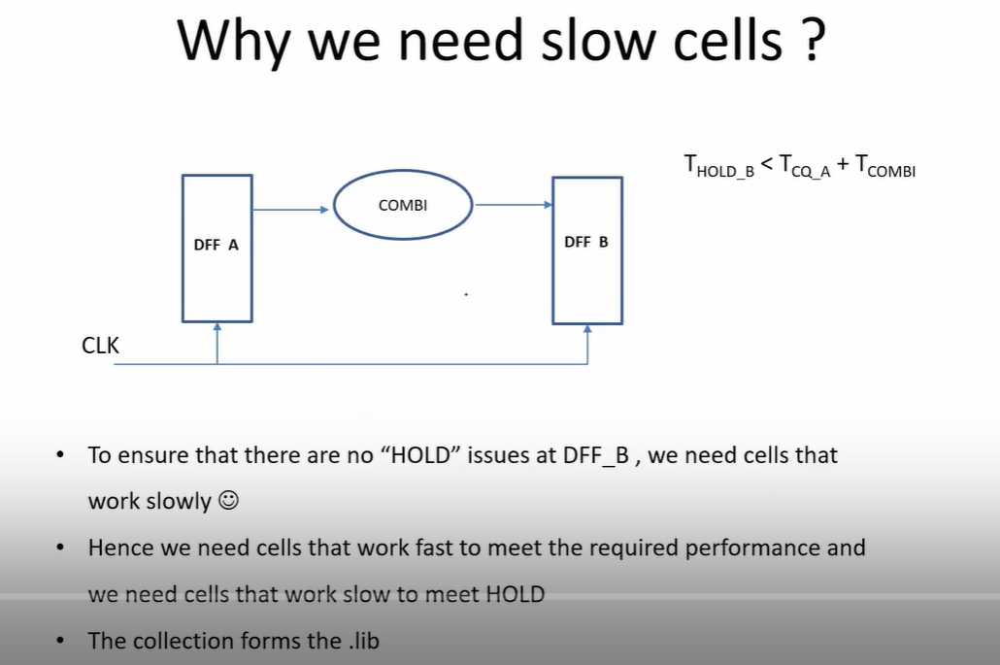 |
| **Netlist Check** | 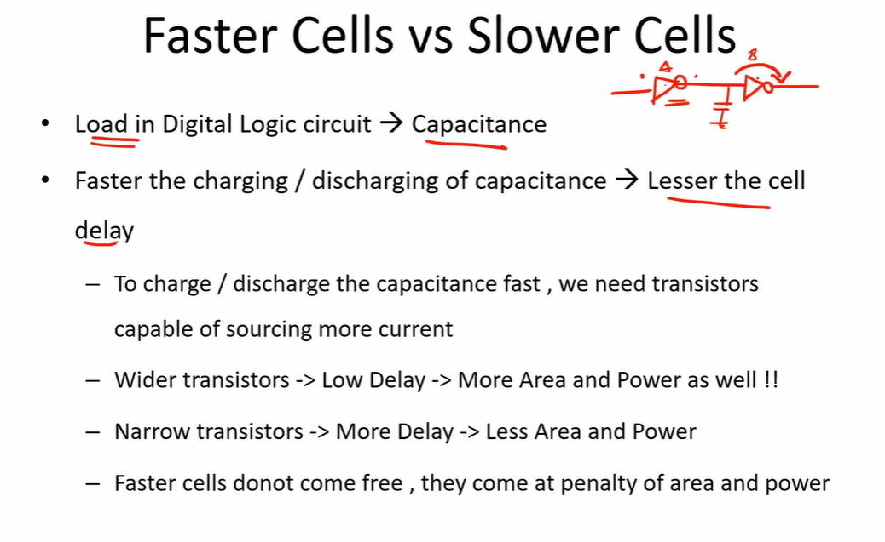 |

---

### Day 3: Libraries and Hierarchy
**Theory:** Exploring PVT corners and Hierarchical vs Flat synthesis.

| Concept | Visualization |
| :--- | :--- |
| **Sky130 Lib** | 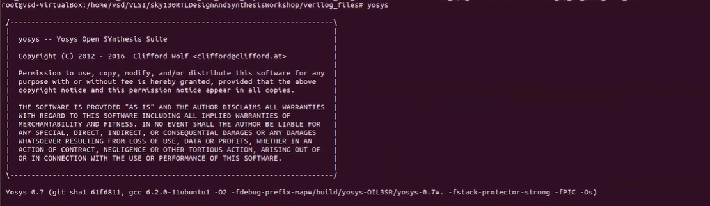 |
| **Cell Models** |  |
| **Hierarchical Map** |  |
| **Flat Synthesis** |  |
| **Mapping Stats** |  |
| **Hierarchy Flow** |  |

---

### Day 4: Sequential Logic & Optimisations
**Theory:** D-Flip Flops, resets, and glitch analysis.

| Lab | Result |
| :--- | :--- |
| **DFF Async Reset** | 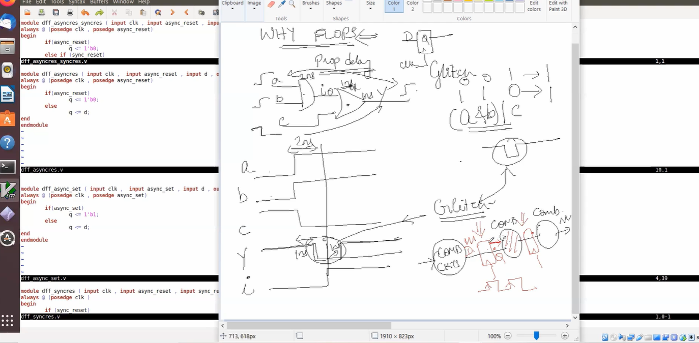 |
| **DFF Sync Reset** |  |
| **DFF Clock Enable** |  |
| **Glitch Analysis** |  |
| **Logic Pruning** |  |

---

### Day 5: GLS & Final Sign-off
**Theory:** Gate Level Simulation for post-synthesis verification.

| Milestone | Waveform / Log |
| :--- | :--- |
| **GLS Waveform** |  |
| **Functional Match** | 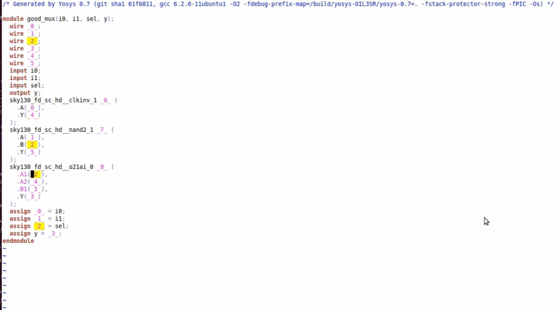 |

---

## 🏁 Conclusion
Through this workshop, I successfully implemented a complete front-end ASIC flow. The project demonstrates the power of open-source EDA tools in designing silicon-ready logic.

## 🖼️ Full Project Gallery

To ensure complete documentation, here is the full set of lab artifacts captured during the workshop.

| | | |
| :---: | :---: | :---: |
|  | 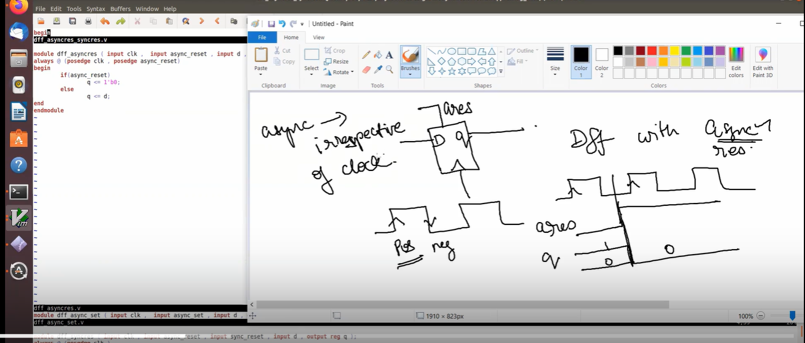 | 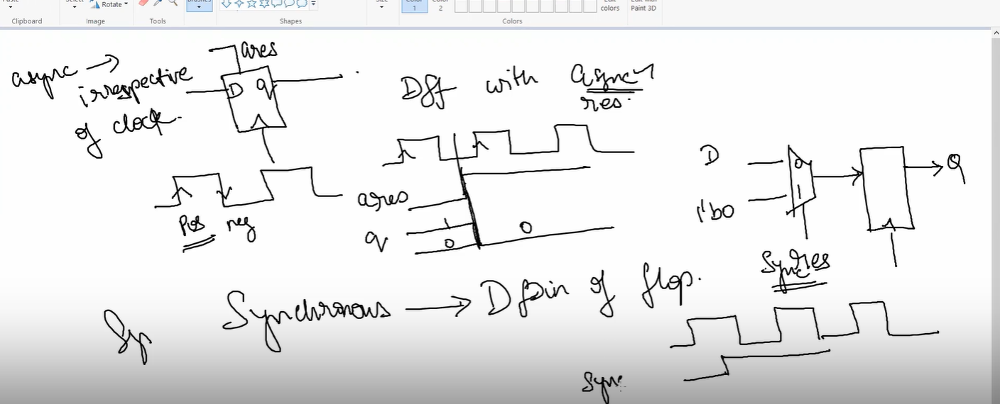 |
| 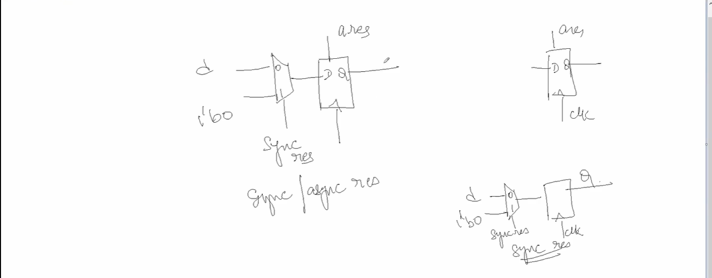 |  |  |
| 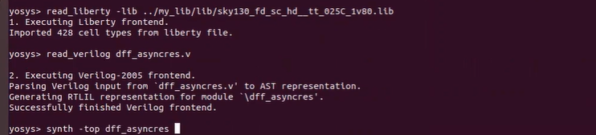 |  |  |
| 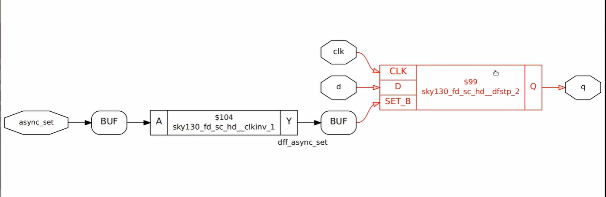 | 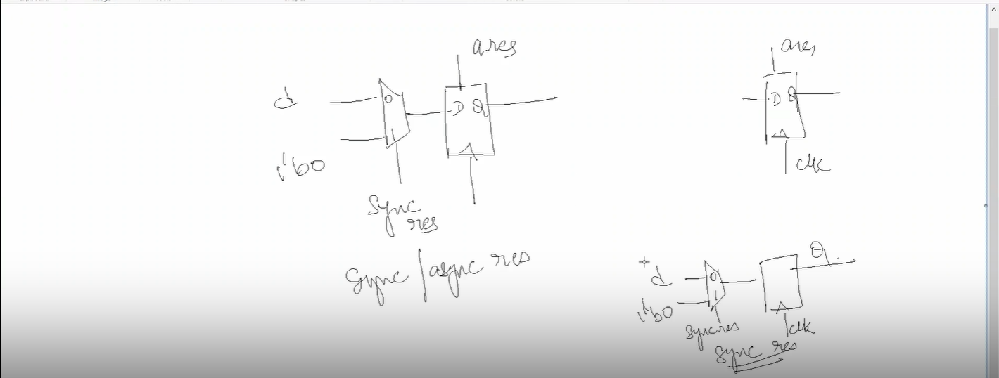 | 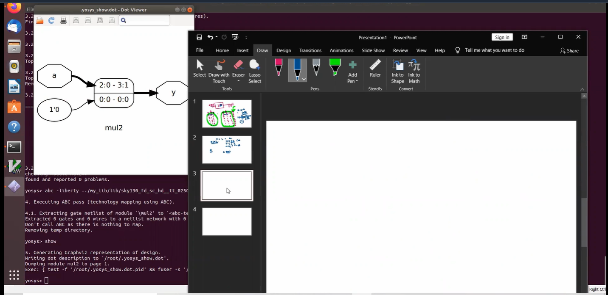 |
|  | 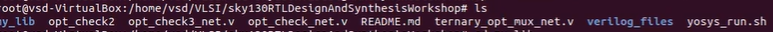 | 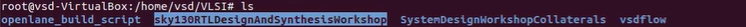 |
| 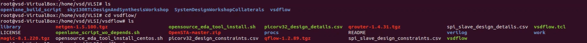 | 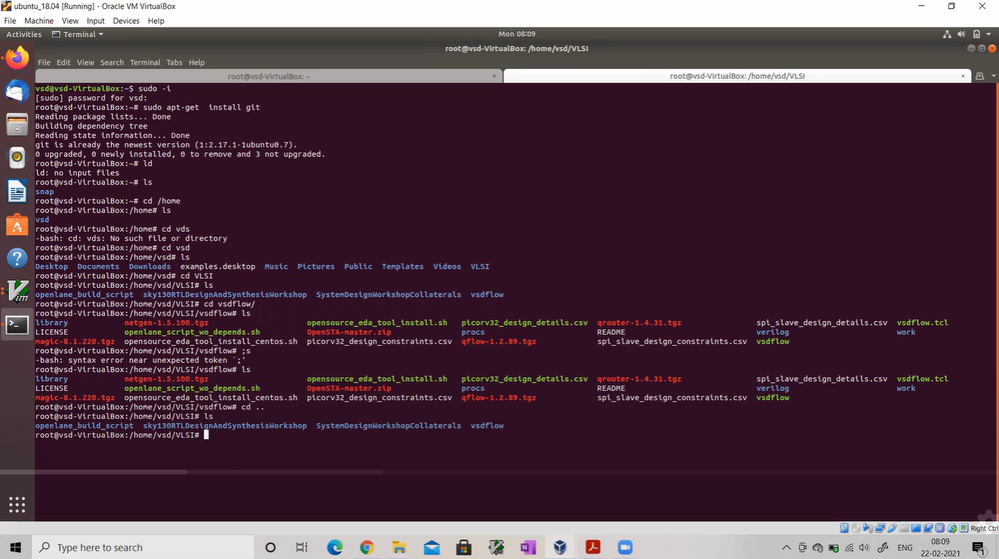 |  |
| 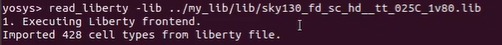 |  |  |

---
**Created by Rachit Srivastava**  
*VSDIAT - Digital Design Program*
